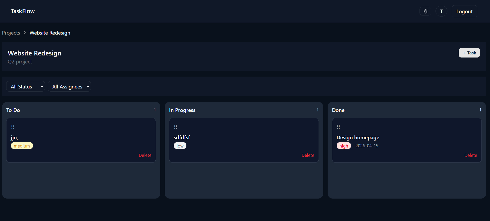

#  TaskFlow – Project Management App



## 1. Overview

TaskFlow is a modern project and task management web application built with **React + TypeScript**.
It allows users to create projects, manage tasks, and track progress using a **Kanban-style board with drag-and-drop support**.

### Features

*  Authentication (Login / Register with JWT)
*  Project management (Create, Edit, Delete)
*  Task management (CRUD operations)
*  Kanban board (Drag & Drop between statuses)
*  Filter tasks by status and assignee
*  Dark mode support
*  Optimistic UI updates (instant feedback)
*  Fully responsive design

---

## 🛠 Tech Stack

### Frontend

* React (Vite)
* TypeScript
* Tailwind CSS
* shadcn/ui
* React Hook Form + Zod
* dnd-kit (drag & drop)

### Mock Backend

* json-server (simulates REST API)

### DevOps

* Docker Compose


## 2. Architecture Decisions

###  Why this structure?

* **Frontend-first approach**: Since this is a frontend-focused implementation, I used `json-server` to simulate backend APIs instead of building a full backend.
* **Component-based architecture**: UI is split into reusable components (Navbar, Cards, Dialogs, Forms).
* **Feature-based structure**: Tasks and Projects are organized logically.
* **Optimistic UI updates**: Improves user experience by updating UI instantly before API response.

---

## 3. Running Locally

###  Prerequisites

* Docker installed


###  Steps

```bash
git clone https://github.com/your-username/taskflow
cd taskflow
cp .env.example .env
docker compose up
```

---
* Local Setup 

**Frontend**
```bash
cd task-flow
npm install
cp .env.example .env
npm run
```

**backend**
```bash
cd mock-server
npm install
npm start
```
---

###  Access

* Frontend: [http://localhost:5173](http://localhost:5173)
* API: [http://localhost:4000](http://localhost:4000)

---

## 4. Running Migrations

Not required.

👉 This project uses **json-server as a mock backend**, so no database migrations are needed.

---

## 5. Test Credentials

Use the following credentials to log in:

```text
Email:    test@example.com
Password: password123
```

---
##  Project Structure

```bash

task-flow/
│
├── task-flow/            #(frontent)  React App (Vite + TS)
│   ├── src/
│   │   ├── api/                 # API layer (axios, endpoints)
│   │   │   ├── axios.ts
│   │   │   └── api.ts   
│   │   │
│   │   ├── assets/              # Images, icons, etc.
│   │   │
│   │   ├── components/
│   │   │   ├── Auth/
│   │   │   │   ├── signin.form.tsx
│   │   │   │   └── signup.form.tsx
│   │   │   │
│   │   │   ├── Projects/
│   │   │   │   ├── AddProject.tsx
│   │   │   │   ├── EditProject.tsx
│   │   │   │   ├── ProjectActions.tsx
│   │   │   │   └── ProjectCard.tsx
│   │   │   │
│   │   │   ├── Tasks/
│   │   │   │   ├── AddTask.tsx
│   │   │   │   ├── EditTask.tsx
│   │   │   │   ├── Column.tsx
│   │   │   │   └── TaskCard.tsx
│   │   │   │
│   │   │   ├── ui/              # shadcn reusable UI components
│   │   │   │
│   │   │   └── Navbar.tsx
│   │   │
│   │   ├── hooks/
│   │   │   └── use-auth.ts
│   │   │
│   │   ├── lib/
│   │   │   └── schema.ts        # validation / zod schemas
│   │   │
│   │   ├── pages/
│   │   │   ├── Projects.tsx
│   │   │   ├── ProjectDetail.tsx
│   │   │   ├── Signin.tsx
│   │   │   └── Signup.tsx
│   │   │
│   │   ├── utils/
│   │   │   └── protectRoute.ts
│   │   │
│   │   ├── App.tsx
│   │   ├── main.tsx
│   │   └── index.css
│   │
│   ├── public/
│   ├── Dockerfile
│   ├── package.json
│   ├── tsconfig.json
│   └── vite.config.ts
│
├── mock-server/                 # Backend (json-server + auth)
│   ├── db.json
│   ├── server.js
│   ├── package.json
│   └── Dockerfile
│
├── docker-compose.yml           # Multi-container setup
├── .gitignore
├── README.md
└── .dockerignore (optional root config)

```

---

## 6. API Reference

###  Auth

#### POST /auth/register

```json
{
  "name": "John Doe",
  "email": "john@example.com",
  "password": "password123"
}
```

---

#### POST /auth/login

```json
{
  "email": "test@example.com",
  "password": "password123"
}
```

---

###  Projects

#### GET /projects

```json
{
  "projects": [...]
}
```

---

#### POST /projects

```json
{
  "name": "New Project",
  "description": "Optional"
}
```

---

#### GET /projects/:id

```json
{
  "id": "1",
  "name": "Project",
  "tasks": [...]
}
```

#### DELETE /projects/:id → Response `204 No Content`

###  Tasks

#### GET /projects/:id/tasks

```json

{ "tasks": [ /* task objects */ ] }
```

#### POST /projects/:id/tasks

```json
{
  "title": "Task",
  "priority": "high",
  "status": "todo"
}
```

---

#### PATCH /tasks/:id

```json
{
  "status": "done"
}
```

#### DELETE /tasks/:id  → Response `204 No Content`

##  Final Thoughts

This project focuses on **frontend engineering quality**, including:

* Clean architecture
* Scalable components
* Strong UX principles
* Real-world patterns (forms, drag-drop, optimistic updates)

---

## ⭐ Author

**Shubham Yadav**


